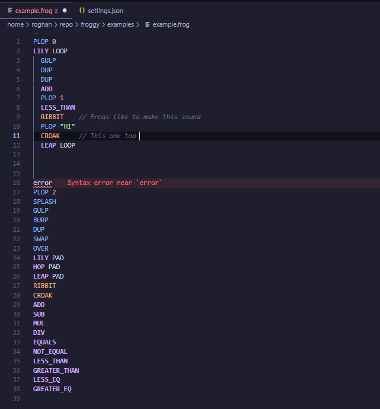

# Froggy-LS

A language server for [Froggy](https://github.com/RoghanBehm/Froggy), a toy, stack-based language. The language [parser](https://github.com/RoghanBehm/tree-sitter-froggy) is generated via a tree-sitter grammar and hosted as a Rust crate on crates.io.

## Example

.